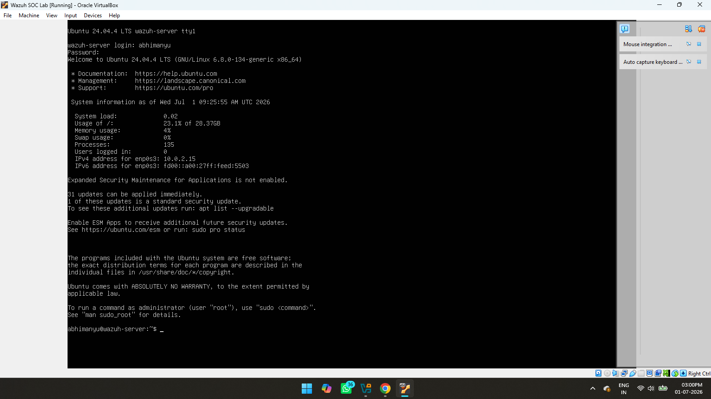

# Chapter 1 – Lab Setup

## Objective

The objective of this chapter is to prepare the SOC lab environment by installing Ubuntu Server, learning basic Linux commands, and updating the operating system before installing Wazuh.

---

## Step 1 – Ubuntu Server Installation

Ubuntu Server was installed as the central server for hosting the Wazuh SIEM platform. A virtual machine was created, and the operating system installation was completed successfully.

**Screenshot**



---

## Step 2 – Basic Linux Commands

After logging into Ubuntu Server, basic Linux commands were used to navigate directories, manage files, and verify the server environment.

Commands practiced include:

- pwd
- ls
- cd
- mkdir
- rm
- cp
- mv
- cat
- clear

**Screenshot**


---

## Step 3 – Updating Ubuntu

Before installing Wazuh, the Ubuntu Server packages were updated to the latest available versions.

Commands used:

```bash
sudo apt update
sudo apt upgrade -y
```

Updating the system ensures security patches are installed and reduces compatibility issues during Wazuh installation.

**Screenshot**


---

## Outcome

At the end of this chapter:

- Ubuntu Server was installed successfully.
- Basic Linux command-line operations were verified.
- The operating system was fully updated and ready for Wazuh installation.
