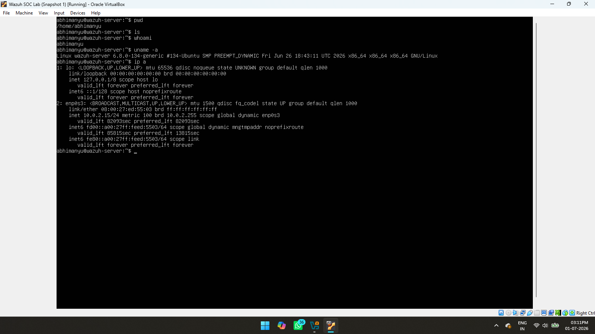

# Linux Basic Commands

## Objective

Learn and practice the essential Linux commands required to manage an Ubuntu Server and perform system administration tasks during the Wazuh installation.

## Commands Practiced

- `pwd`
- `ls`
- `cd`
- `mkdir`
- `cp`
- `mv`
- `rm`
- `cat`
- `nano`
- `sudo`
- `clear`

## Why These Commands Matter

These commands were used throughout the project to navigate directories, edit configuration files, manage system files, and execute administrative tasks while setting up the Wazuh environment.

## Screenshot

## Result

Gained practical experience with essential Linux commands required to install, configure, and manage the Wazuh server.
