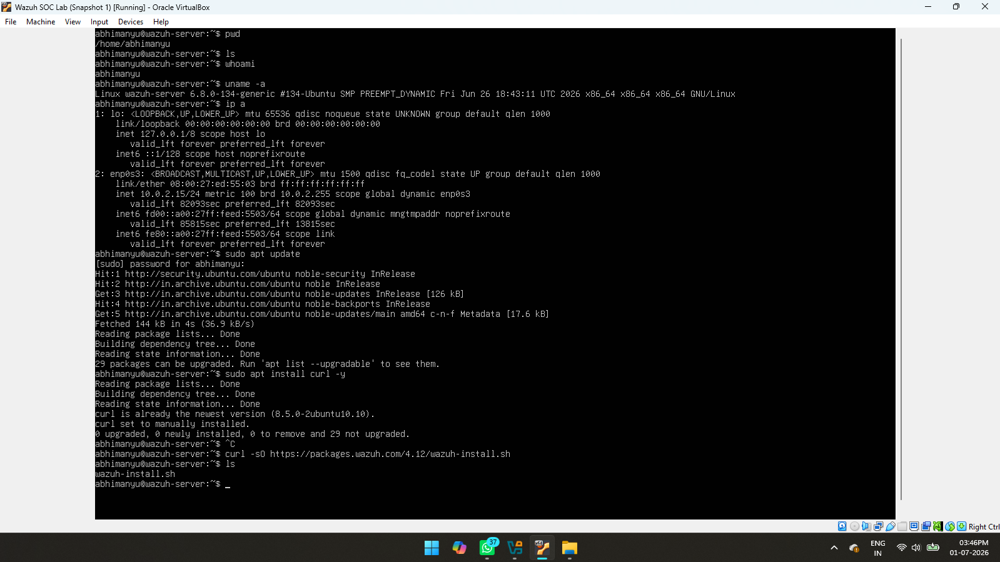
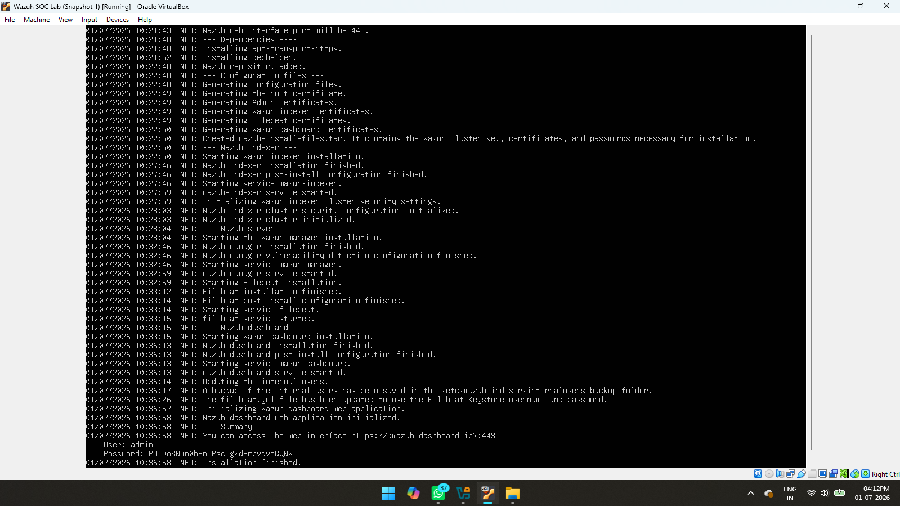
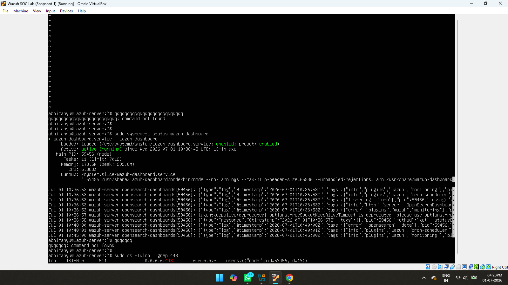

# Chapter 2 – Wazuh Installation

## Objective

The objective of this chapter is to install the Wazuh SIEM platform on Ubuntu Server and verify that the Wazuh Dashboard is accessible from the Windows machine.

---

## Step 1 – Download Wazuh Installer

The official Wazuh installation script was downloaded on the Ubuntu Server using the terminal.

This script automatically installs the Wazuh Manager, Indexer, and Dashboard.

**Screenshot**



---

## Step 2 – Install Wazuh

The installation script was executed on Ubuntu Server. The installation process automatically configured all required Wazuh components.

The installation took several minutes to complete successfully.

**Screenshot**



---

## Step 3 – Access the Wazuh Dashboard

After the installation was completed, the Wazuh Dashboard was opened from the Windows machine using a web browser.

The dashboard was accessed using the Ubuntu Server IP address over HTTPS (Port 443).

Example:

```text
https://<Ubuntu_Server_IP>
```

Successful login confirmed that the Wazuh platform was installed correctly and ready for monitoring.

**Screenshot**



---

## Outcome

At the end of this chapter:

- Wazuh SIEM was installed successfully.
- All core Wazuh components were configured.
- The dashboard was accessed successfully from the Windows endpoint.
- The environment was ready for endpoint monitoring.
