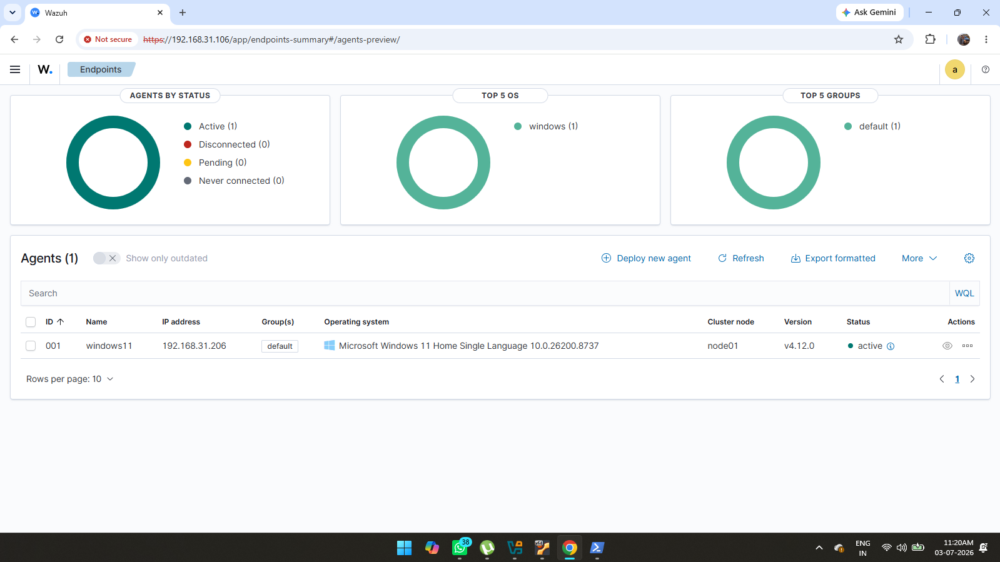
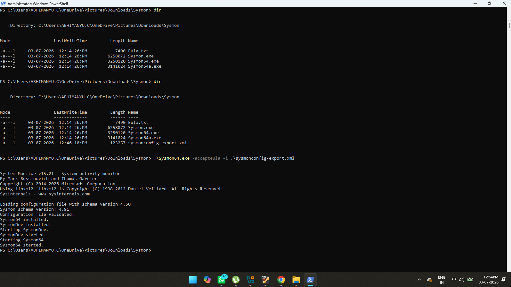
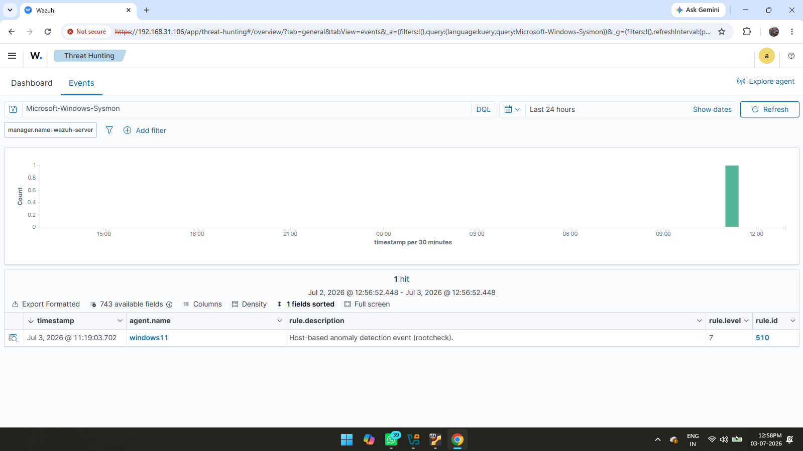

# Chapter 3 – Windows Agent and Sysmon Configuration

## Objective

The objective of this chapter is to connect the Windows endpoint to the Wazuh server, install Sysmon, and verify that Windows event logs are successfully collected by Wazuh.

---

## Step 1 – Connect Windows Agent

The Wazuh Agent was installed on the Windows 11 endpoint and registered with the Wazuh Server.

Once connected, the endpoint appeared as **Active** in the Wazuh Dashboard.

**Screenshot**

---

## Step 2 – Install Sysmon

Microsoft Sysmon was installed on the Windows endpoint to provide detailed system monitoring.

Sysmon records important security events such as:

- Process creation
- Network connections
- File creation
- Registry modifications

These events are forwarded to Wazuh for analysis.

**Screenshot**

---

## Step 3 – Verify Sysmon Events

After Sysmon installation, the generated events were successfully received and displayed in the Wazuh Dashboard.

This confirmed that Windows event logs were being collected correctly.

**Screenshot**

---

## Outcome

At the end of this chapter:

- Windows endpoint was connected to Wazuh.
- Sysmon was installed successfully.
- Windows event logs were forwarded to Wazuh.
- The monitoring environment was fully operational.
