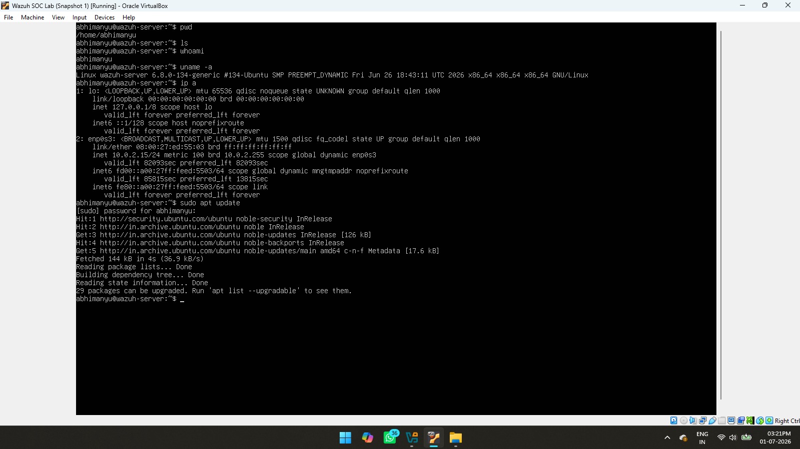

# System Update

## Objective

Update the Ubuntu Server to ensure all installed packages were up to date before installing the Wazuh platform.

## Why This Step Matters

Updating the operating system helps resolve known bugs, installs the latest security patches, and reduces compatibility issues during software installation. It is considered a standard best practice before deploying security tools.

## Commands Used

```bash
sudo apt update
sudo apt upgrade
```

## Screenshot



## Result

The Ubuntu Server was successfully updated and prepared for the Wazuh installation process.
