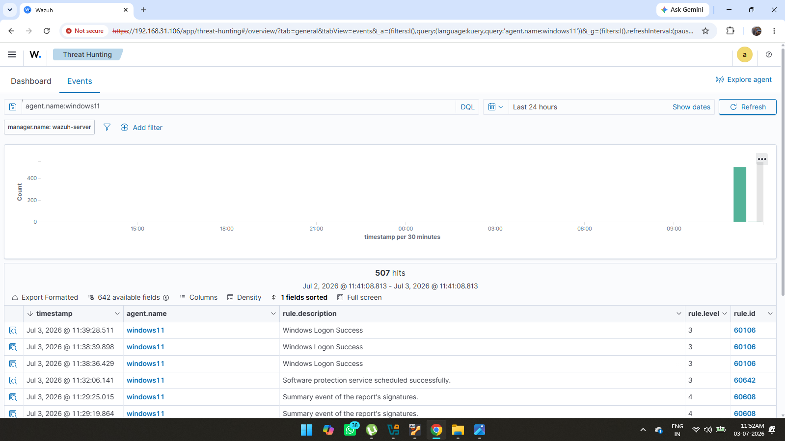
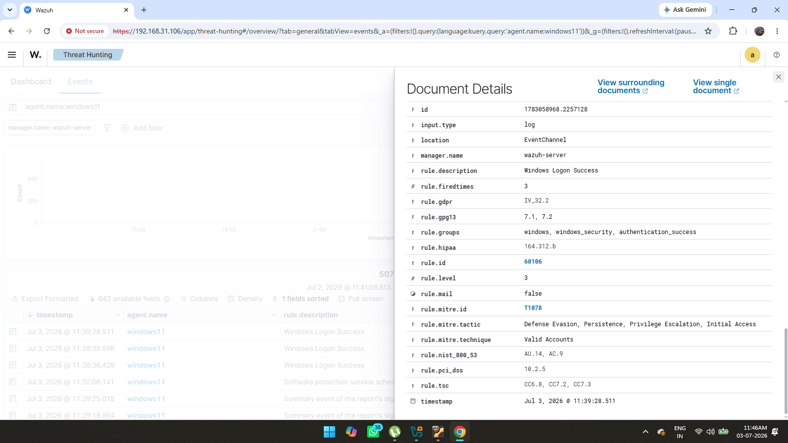
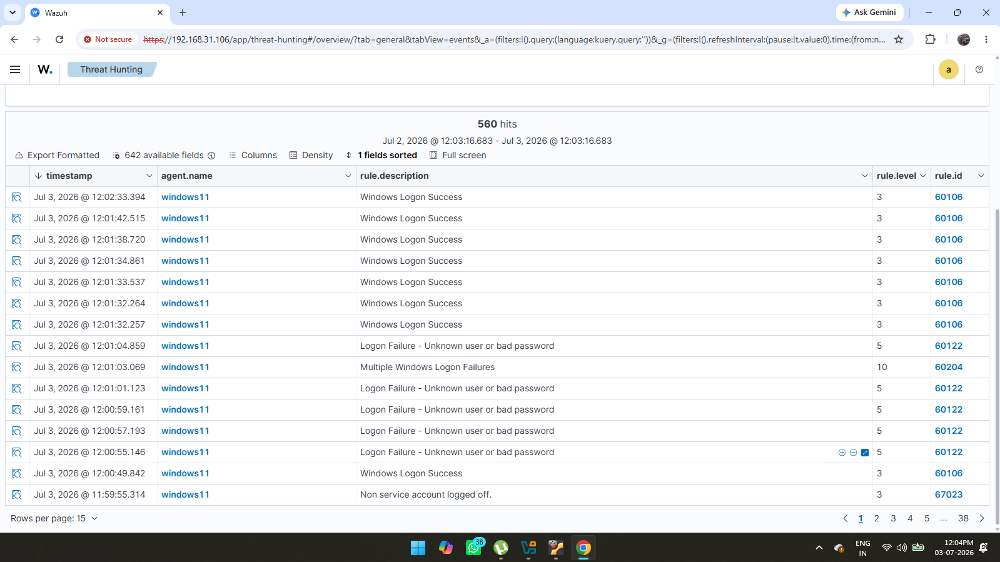

# Chapter 4 – Threat Hunting

## Objective

The objective of this chapter is to verify that security events generated by the Windows endpoint are successfully collected by Wazuh and can be investigated through the Threat Hunting dashboard.

---

## Step 1 – Threat Hunting Dashboard

After the Windows endpoint was connected and Sysmon was configured, the Threat Hunting module was used to monitor incoming security events in real time.

The dashboard provides a centralized view of collected logs, allowing analysts to search, filter, and investigate suspicious activities.

**Screenshot**

---

## Step 2 – Event Investigation

Each event generated by the endpoint contains detailed information such as:

- Rule ID
- Rule Description
- Severity Level
- Agent Name
- Timestamp
- MITRE ATT&CK Mapping

These details help security analysts understand what happened on the endpoint and determine whether the activity is legitimate or suspicious.

**Screenshot**

---

## Step 3 – Authentication Event Detection

The Threat Hunting dashboard was also used to identify Windows authentication events. Failed login attempts were successfully collected and displayed, demonstrating that Wazuh can monitor authentication-related activities.

**Screenshot**

---

## Outcome

At the end of this chapter:

- Successfully monitored endpoint events using the Threat Hunting dashboard.
- Investigated detailed event information.
- Verified that authentication events were being collected and analyzed.
- Confirmed that the SIEM environment was ready for attack simulation and threat detection.
