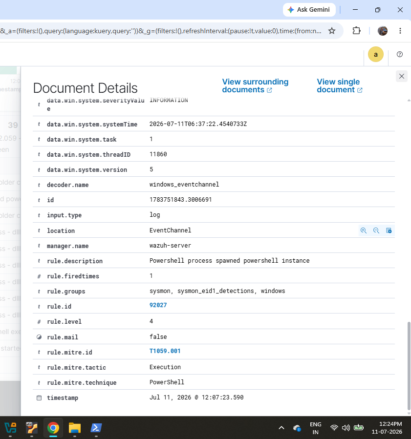

# Chapter 5 - Attack Simulations

## Objective

The objective of this chapter is to simulate common attack techniques on the Windows endpoint and verify that Wazuh successfully detects and records the corresponding security events.

---

## Attack 1 - PowerShell Process Execution

PowerShell was executed to simulate script execution activity commonly observed during cyber attacks. Wazuh detected the PowerShell process creation and generated an alert for investigation.

### Screenshot

*Figure 13: Detection of PowerShell process execution.*

---

## Attack 2 - Suspicious Windows Command Shell Execution

The Windows Command Prompt (cmd.exe) was executed to simulate suspicious command-line activity. Wazuh detected the command shell execution and generated an alert with MITRE ATT&CK mapping.

### Screenshot

*Figure 14: Detection of suspicious command shell execution.*

---

## Attack 3 - Executable File Dropped

An executable file was copied into a temporary directory to simulate malware being dropped on the system. Wazuh detected the file creation event and generated an alert.

### Screenshot

*Figure 15: Detection of executable file creation.*

---

## Attack 4 - Base64 Encoded PowerShell Command

A Base64 encoded PowerShell command was executed to simulate an obfuscated attack technique. Wazuh detected the encoded PowerShell command and generated a security alert.

### Screenshot

*Figure 16: Detection of Base64 encoded PowerShell execution.*

---

## Attack 5 - Multiple Windows Logon Failures

Several failed Windows logon attempts were generated to simulate a brute-force attack. Wazuh recorded each authentication failure and raised an alert.

### Screenshot

*Figure 17: Detection of multiple failed Windows logon attempts.*

---

## Attack 6 - Brute Force Detection Overview

The generated authentication events were correlated by Wazuh to provide an overview of the simulated brute-force attack.

### Screenshot

*Figure 18: Brute-force attack detection overview.*

---

## Outcome

At the end of this chapter:

- Multiple attack techniques were successfully simulated.
- Wazuh detected each malicious activity and generated appropriate alerts.
- The generated alerts demonstrated Wazuh's ability to monitor endpoint activity and identify suspicious behavior.
