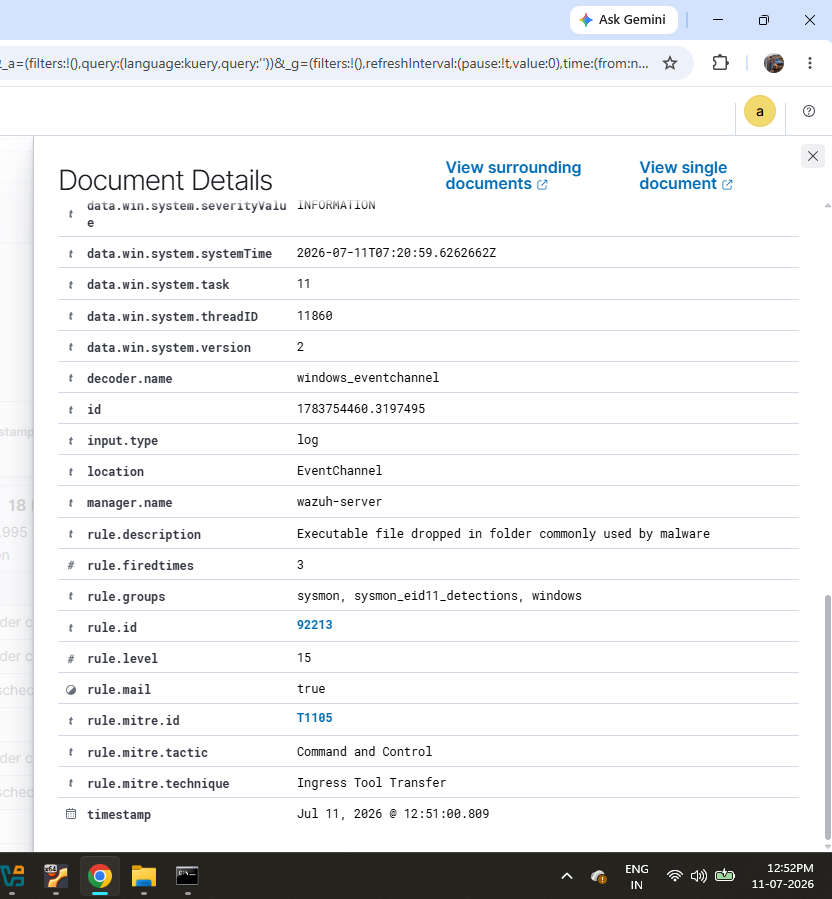
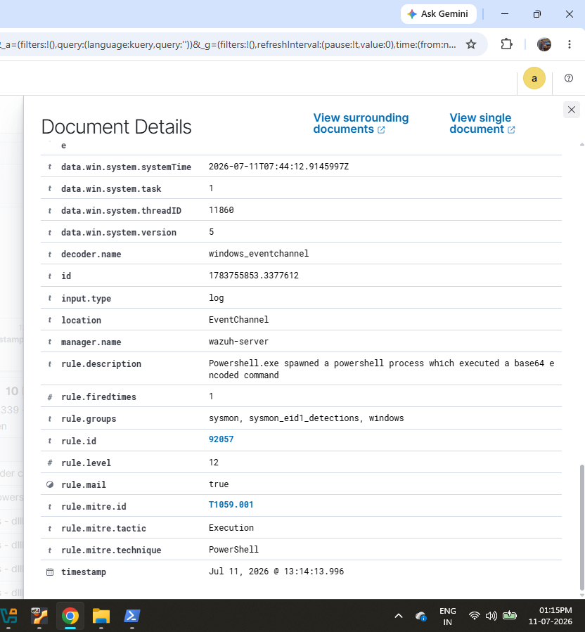

# Chapter 5 – Attack Simulations and Detection

## Objective

The objective of this chapter is to simulate common attack techniques on the Windows endpoint and verify that Wazuh detects and logs these activities. Each simulation demonstrates how security events are collected, analyzed, and mapped to the MITRE ATT&CK framework.

---

## Attack 1 – PowerShell Process Execution

PowerShell is commonly abused by attackers to execute scripts, download malware, or perform post-exploitation activities. Wazuh detected the PowerShell process creation and generated an alert for further investigation.

**Screenshot**

---

## Attack 2 – Suspicious Windows Command Shell Execution

The Windows Command Prompt (cmd.exe) was executed to simulate command-line activity commonly used by attackers.

Wazuh detected the suspicious command shell execution and generated an alert with MITRE ATT&CK mapping.

**Screenshot**

---

## Attack 3 – Executable Dropped in a Temporary Folder

An executable file was copied into the Windows temporary directory to simulate malware being placed in a commonly abused location.

Wazuh detected the file creation activity and generated a high-severity alert.

**Screenshot**

---

## Attack 4 – Base64 Encoded PowerShell Command

A Base64-encoded PowerShell command was executed to simulate an obfuscated attack technique.

Obfuscation is frequently used by attackers to hide malicious commands and evade basic detection.

Wazuh successfully detected the encoded PowerShell execution.

**Screenshot**

---

## Attack 5 – Multiple Windows Logon Failures (Brute Force Simulation)

Multiple failed login attempts were intentionally generated on the Windows endpoint to simulate a brute-force attack.

Wazuh correlated the repeated authentication failures and produced alerts indicating multiple Windows logon failures.

**Screenshot**

---

## Attack 6 – Brute Force Detection Overview

The Threat Hunting dashboard displayed all related authentication events, providing an overview of the simulated brute-force activity.

This demonstrated how Wazuh helps analysts investigate authentication attacks through centralized log collection and correlation.

**Screenshot**

---

## Outcome

The simulated attack techniques confirmed that Wazuh successfully detected suspicious PowerShell activity, command-line execution, executable file creation, and repeated failed logon attempts. The generated alerts included detailed event information and MITRE ATT&CK mappings, demonstrating the effectiveness of Wazuh for endpoint monitoring and threat detection.
